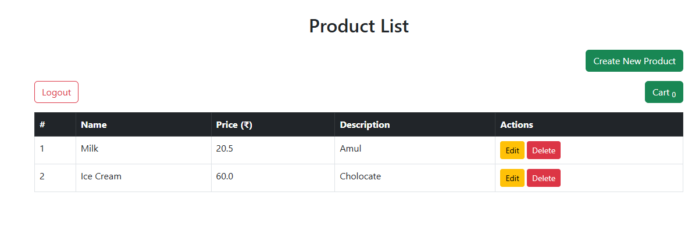

# 🛒 E-Commerce Web Application (Spring Boot + JSP)

A beginner-friendly full-stack e-commerce application built with **Spring Boot**, **JSP**, and **MySQL**. It allows users to register/login, browse products, add items to cart, place orders, and includes an admin panel to manage products.

---

## 🚀 Features

- User Registration & Login (Admin/User roles)
- Product Listing, View Product Details
- Add to Cart, View & Remove from Cart
- Place Order from Cart
- View Order History (per user)
- Admin Panel:
  - Add/Edit/Delete Products
  - View All Orders

---

## 🧱 Tech Stack

- **Backend:** Java 17, Spring Boot
- **Frontend:** JSP, HTML, Bootstrap, JSTL
- **Database:** MySQL
- **ORM:** Spring Data JPA (Hibernate)
- **Build Tool:** Maven
- **IDE:** IntelliJ IDEA

---

## 📸 Screenshots

> Place these images in a `/screenshots/` folder inside the project.

| Page | Screenshot |
|------|------------|
| Home Page |  |
| Product Listing |  |
| Cart Page |  |
| Order History |  |
| Admin Panel |  |

---

## ⚙️ How to Run Locally

### 1. Clone the Repository

```bash
git clone https://github.com/your-username/ecommerce.git
cd ecommerce


2. Configure the Database
Create a new MySQL database called ecommerce, then update the file:
📄 src/main/resources/application.properties

properties
Copy
Edit
spring.datasource.url=jdbc:mysql://localhost:3306/ecommerce
spring.datasource.username=root
spring.datasource.password=your_password
spring.jpa.hibernate.ddl-auto=update


3. Build & Run the Project
bash
Copy
Edit
mvn clean install
mvn spring-boot:run
4. Open in Browser
text
Copy
Edit
http://localhost:8080/


🧑‍💻 Default User & Admin Login
You can insert these into your MySQL database manually:

sql
Copy
Edit
-- Users Table Example (add admin directly to database to set its role admin)
INSERT INTO users (id, username, password, role) VALUES (1, 'admin', 'admin123', 'ADMIN');
INSERT INTO users (id, username, password, role) VALUES (2, 'user', 'user123', 'USER');

-- Sample Products
INSERT INTO product (id, name, description, price) VALUES (1, 'Laptop', 'High performance laptop', 49999);
INSERT INTO product (id, name, description, price) VALUES (2, 'Headphones', 'Wireless noise-canceling headphones', 2999);
You can adjust table/column names based on your entity classes.

🧪 Running Tests
The project uses JUnit 5 for unit testing.

To run tests:
bash
Copy
Edit
mvn test

🧰 Project Structure
swift
Copy
Edit

ecommerce/
├── src/
│   ├── main/
│   │   ├── java/com/example/ecommerce/
│   │   │   ├── controller/
│   │   │   ├── service/
│   │   │   ├── repository/
│   │   │   ├── model/
│   │   │   └── EcommerceApplication.java
│   │   └── resources/
│   │       ├── static/
│   │       ├── templates/   # JSP files
│   │       └── application.properties
├── screenshots/             # Place your UI images here
└── pom.xml


💡 Future Improvements
✅ Product search and filtering

✅ Pagination on product list

🔒 Secure login with JWT

🖼️ Upload product images

🧾 Invoice generation

💳 Integrate payment gateway

💬 Add reviews & ratings

🤝 Contribution
Feel free to fork this repository, raise issues, and contribute pull requests.
Contributions are welcome!

👤 Author
Jeetesh
Java Developer | DSA Learner | Project Builder
🌱 Exploring Spring Boot, LibGDX, and React

📄 License
This project is free and open-source.
You can modify, use, and share it under your own license terms.


